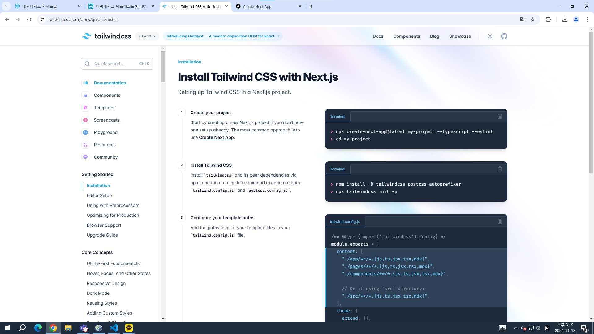
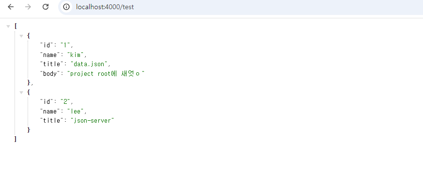
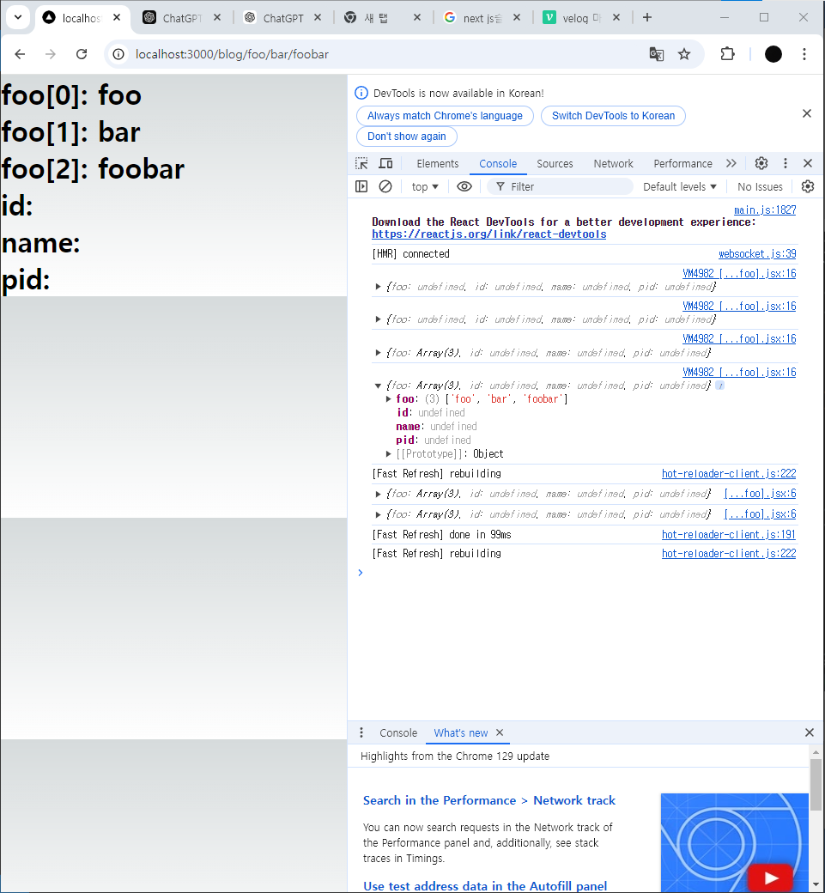
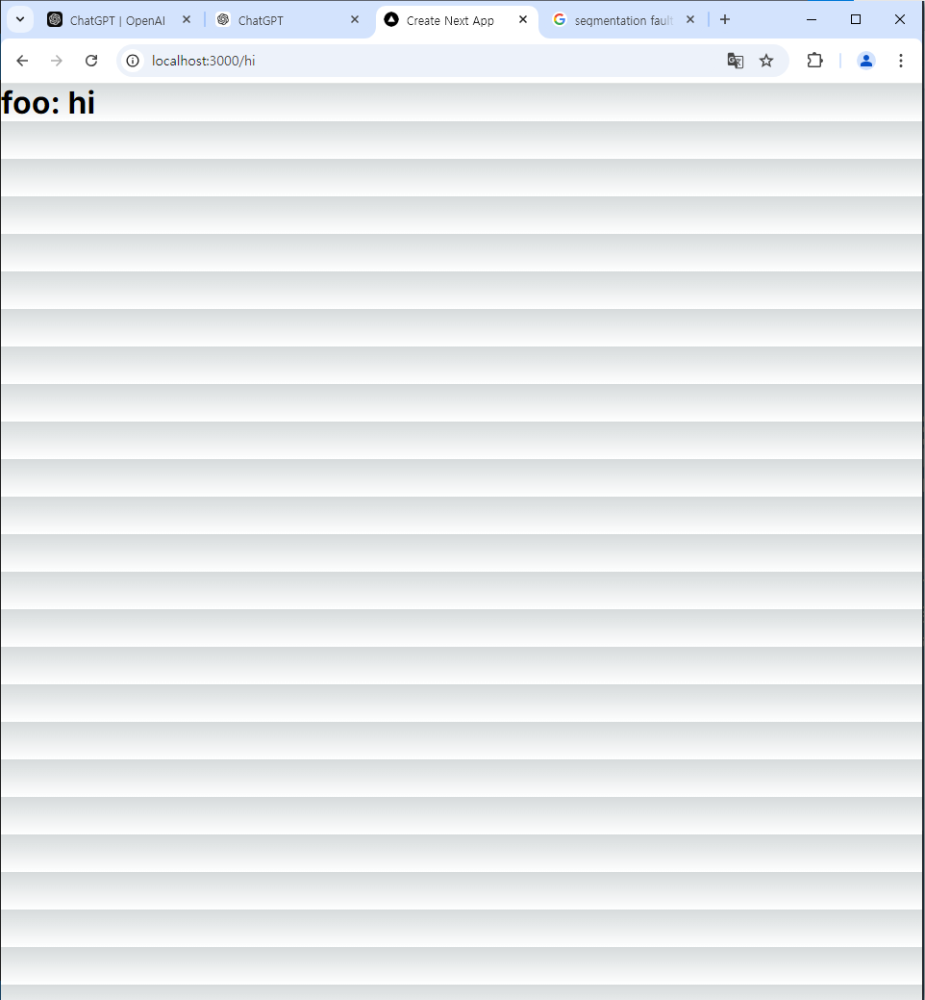

# React02_DaeLim
<br>

## 202230233 정재승
<br>

## 2024-11-13 12주차

### 07.UI 프레임워크

### 07-1 UI 라이브러리

* #### UI 라이브러리, 프레임웤, 유틸리티 기능이 필수는 아니다. 
* #### 다만 생산성 향상 및 UI의 일관성을 유지하는데 많은 도움을 받을 수 있다. 
* #### 이번 장에서는 다음 3가지의 프레임워크에 관해 간단히 알아 보자.
* #### chakra UI
* #### TailwindCSS
* #### HeadlessUI

### 07-2 Chakra UI

### 07-3 Tailwind CSS
* #### 다른 플에ㅣㅁ워크와는 다르게 CSS 규칙만을 제공한다. 
* #### 자바스크립트 모듈이나 리엑트 컴포넌트를 제공하지 않기 때문에 필요한 경우 직접 만들어서 사용해야 한다 
* #### 변수값을 조정하여 개성있는 디자인을 만들 수 있다. 디자인의 자유도가 높다.
* #### dark mode 및 light mode를 쉽게 적용할 수 있다.
* #### 빌드 시점에 사용하지 않는 클래스는 제거 되기 때문에 높은 수준의 최적화를 지원한다.
* #### CSS 클래스의 접두사를 활용해서 모바일, 데스크톱, 태블릿 화면에서 원하는 규칙을 지정할 수 있다. 

### 07-04 HeadlessUI
* #### TailwindCSS를 만든 Tailwind Labs 팀의 무료 오픈소스 프로젝트이다.
* #### TailwindCSS는 웹 컴포넌트 안에서 사용할 수 있는 CSS클래스만 제공한다. 
* #### 따라서 모달이나 버튼 등 동적인 컴포넌트를 만들려면 직접 자바스크립트 코드를 작성해야 한다. 
* #### 이런 단점을 보완하기 위해서 Headless UI가 탄생했다.
* #### Headless UI은 CSS클래스를 제공하는 것이 아니라 동적 컴포넌트만 제공한다. 


### 1. Project 생성
* #### Tailwind 사용을 위해 프로젝트를 다시 생성합니다.
* #### 프로젝트를 다시 생성하지 않고 설정할 수도 있지만 과정이 다소 복잡하다.
* #### 프로젝트는 NEXT.js14로 한다.
* #### 15.0.2 버전이 릴리즈 되어 있으나 아직 Tailwind와의 호환성이 안정적이지 않다.
* #### $npx create-next-app@14
* #### 프로젝트 이름은 자유로 하고, 나머지는 모두 yes로 한다.




### 3. Headless UI

```jsx
import { Menu, MenuButton, MenuItem, MenuItems,Button  } from '@headlessui/react'

export default function Headless(){
    return (
        <>
            <h1>Headless UI</h1>
            <Menu>
      <MenuButton>My account</MenuButton>
      <MenuItems anchor="bottom">
        <MenuItem>
          <a className="block data-[focus]:bg-blue-100" href="/settings">
            Settings
          </a>
        </MenuItem>
        <MenuItem>
          <a className="block data-[focus]:bg-blue-100" href="/support">
            Support
          </a>
        </MenuItem>
        <MenuItem>
          <a className="block data-[focus]:bg-blue-100" href="/license">
            License
          </a>
        </MenuItem>
      </MenuItems>
    </Menu>
    <Button className="rounded bg-sky-600 py-2 px-4 text-sm text-white data-[hover]:bg-sky-500 data-[active]:bg-sky-700">
      Save changes
    </Button>
        </>
    )
}
```


4. ### Chakra UI
* #### 구글에서 Chakra UI를 검색하고 사이트에 접속합니다.
* #### Home화면에서 Start Building 버튼을 클릭하고 Next.js를 선택한다.
* #### App/chakra/page.js 파일을 생성한다.
* #### 지시대로 설치한다. 


https://www.chakra-ui.com/docs/get-started/frameworks/next-app


```jsx
import { Button } from "@/components/ui/button"
import { HStack,AspectRatio  } from "@chakra-ui/react"
import {
    AccordionItem,
    AccordionItemContent,
    AccordionItemTrigger,
    AccordionRoot,
  } from "@/components/ui/accordion"

export default function Chakra(){
    return(
        <>
        <HStack>
        <Button>Click me</Button>
        <Button>Click me</Button>
      </HStack>
      <AspectRatio ratio={16 / 9}>
      <iframe src="https://www.google.com/maps/embed?pb=!1m18!1m12!1m3!1d3963.952912260219!2d3.375295414770757!3d6.5276316452784755!2m3!1f0!2f0!3f0!3m2!1i1024!2i768!4f13.1!3m3!1m2!1s0x103b8b2ae68280c1%3A0xdc9e87a367c3d9cb!2sLagos!5e0!3m2!1sen!2sng!4v1567723392506!5m2!1sen!2sng" />
    </AspectRatio>

    <AccordionRoot collapsible defaultValue={["b"]}>
      {items.map((item, index) => (
        <AccordionItem key={index} value={item.value}>
          <AccordionItemTrigger>{item.title}</AccordionItemTrigger>
          <AccordionItemContent>{item.text}</AccordionItemContent>
        </AccordionItem>
      ))}
    </AccordionRoot>
      </>
    )
}

const items = [
    { value: "a", title: "First Item", text: "Some value 1..." },
    { value: "b", title: "Second Item", text: "Some value 2..." },
    { value: "c", title: "Third Item", text: "Some value 3..." },
  ]
  ```
  

  ### 5. React-icon

  ```jsx
  import { DiApple } from "react-icons/di";

export default function ReactIcon(){
    return (
        <>
            <h1>React Icon</h1>
            <DiApple size={300}/>
        </>
    )
}
```


## 2024-11-06 11주차

### 06. CSS와 내장 스타일링 메서드

### 6.1 Styled JSX

* #### Styled JSX는 CSS-in-JS 라이브러리 입니다. 내장 모듈이기 때문에 설치가 필요 없습니다. 
* #### 즉, CSS속성 지정을 위해 자바스크립트를 사용할 수 있는 라이브러리 이다.

```jsx
"use client";

export default function CssEx(){
    return(
        <>
        <h1>CssEx Page</h1>    
        <button className="button">버튼1</button>
        <style jsx>{`
            .button{
                background: green;
                color: white;
            }       
        `}
        </style>
        </>
    )
}
```


### CSS-in-JS의 단점
* #### IDE나 코드 편집기 등 개발 도구에 대한 지원이 부족하다. 
* #### 문법 하이라이팅, 자동 완성, 린트 기능을 제공하지 않는다.
* #### 코드 내에서 CSS에 대한 의조성이 점점 커지기 때문에 앱 번들도 커지고 느려진다.
* #### 서버에 미리 CSS를 생성해도 클라이언트에서 리액트 하이드레이션이 끝나면 CSS를 다시 생성해야 ㅏㄴ다.


### 6.2 CSS Module 
* #### CSS-in-JS의 단점을 회피하ㅣ 위한 좋은 방법은 바로 CSS Module이다.

```jsx
import Image from "next/image";
import styles from "./page.module.css";

export default function Home() {
  return (
    <>
    <h1 className={styles.main}>Home Page</h1>
    <h1 className={styles.title}>Home Page</h1>
    </>
  )

}
```
```jsx
.title{
  color: red;
}


.main {
  display: flex;
  flex-direction: column;
  justify-content: space-between;
  align-items: center;
  padding: 6rem;
  min-height: 50vh;
}
```


----


#### composes

```jsx
.woo{
    color: green;
    background: red;
    display: flex;
    flex: 1;
}

.gie{
    composes: woo;
    color: yellow;
}
```


### 06-3 SASS
* #### Next에서 기본으로 지원하는 전 처리기 입니다.
* #### 단 패키지 설치가 필요하다. $ npm install sass
* #### SASS 및 SCSS(Sassy CSS) 문법으로 CSS Moudule을 만들고 사용할 수 있다. 

```jsx
$font-size: red;

.bar{
    color: $font-size;
}
```


## 2024-10-30 10주차

* #### 서버에서는 두 가지 방법으로 HTTP 요청을 만들고 처리할 수 있다. 
  * #### Node의 내장 HTTP 라이브러리를 사용할 수 있다. 다만 서드파티 HTTP 클라이언트와 비교했을 때 설정하고 처리해야 할 작업이 더 많은 편이다. 
  * #### HTTP 클라이언트 라이브러리를 사용할 수 있다 가장 유명한 것이 Axios이다.

### 서버에서 REST API 사용하기 
* #### REST API를 호출할 때는 public API를 호출할 것인지, private API를 호출할 것인지를 먼저 확인해야 한다.

1. ### REST API - 기본 설계 규칙 
* #### URI는 동사보다는 명사를, 대문자보다는 소문자를 사용하여야 한다.
  ```
  Bad Example: https://developer.n.com/Running/
  Good Example: https://developer.n.com/run/```

* #### 주소의 마지막에 슬래시(/)를 포함하지 않습니다.
  ``` 
  Bad Example: https://developer.n.com/test/
  Good Example: https://developer.n.com/test
  ```

* #### 단어를 연결할 때는 하이픈(-)을 사용합니다.
  ```
  Bad Example: https://developer.n.com/test_blog
  Good Example: https://developer.n.com/test-blog
  ```

* ####  파일확장자는 URI에 포함하지 않습니다.
  ```
  Bad Example: https://developer.n.com/photo. jpg
  Good Example: https://developer.n.com/photo
  ```

* #### URI에 메소드를 포함하지 않습니다.
  ```
  Bad Example: https://developer.n.com/ delete-post/1
  Good Example: https://developer.n.com/post/1
  ```

### JSON SEVER
 

 

 

 

 

 

 3. ### Axuis란 
 * ##### Next.js에서 REST API를 다룰 때는 보통 axios와 fetch 중 하나를 선택하는 경우가 많다. 


 ### [Fetch API]
 * #### 내장 API 브라우저에 내장되어 있어 별도의 설치가 필요 없다.
 * #### Promise ㄱ비ㅏㄴ: 비동기 작업을 처리하는 데 익숙한 구조
 * #### 스트림 처리: 데이터를 스트리밍으로 처리할 수 있는 기능이 있어, 큰 파일을 처리하는데 유용하다.
 #### 단점은 ...
 * #### json 변환 수동 처리 
 * #### 에러 처리 복잡성

 3. ### Axios 사용하기
 #### npm i axios


```jsx
import axios from "axios";

export default async function Axios(){
    const res = await axios.get ("http://localhost:4000/test") 
    const users = res.data
    console.log(users)

    return(
        <>
        <h1>axios</h1>
        {
            users.map((user,id) => {
                return (
                    <div key={id}>
                        <h2>{user.id}</h2>
                        <h3>{user.name}</h3>
                        <h3>{user.title}</h3>
                        <h3>{user.body}</h3>
                    </div>
                )
            })
        }
        </>
    );
    


}
```

### 위 코드 개선 할 부분
1. #### useState와 useEffect 사용
  * #### 비동기 데이터를 가져오는 작업은 컴포넌ㅌ으ㅢ 사태로 관리하는 것이 이반적이다. 현재 코드에서는 users 데이터가 비동기적으로 로드되는데, 이를 관리하기 위한 useState와 useEffect 훅이 빠져 있다.
  * #### 데이터를 로드하기 전에 컴포넌트가 렌더링되기 때문에, users 변수가 초기에는 존재하지 않아 undefined 에러가 발생할 가능성이 있다. 
2. #### Loading 상태 처리 

```jsx
"use client";

import axios from "axios";
import { useState,useEffect } from "react";

export default function Axios(){
    const [users, setUsers] = useState(null)
    const [loading, setLoading] = useState(null)

    useEffect(() => {
        const fetchUsers = async ()  => { 
            try{
                const res = await axios.get ("http://localhost:4000/test");
                setUsers(res.data)//상태 업데이트
            }catch(error){
                console.error("Error",error)
            }finally{
                setLoading(false)//로딩 업데이트 
            }
        }
        fetchUsers()//로딩 완료

    }, [])// 컴포넌트가 마운트 될때만 실행

    if(loading) return <h1>Loading....</h1>// 로딩 중일 때 
    if(!users) return <h1>No Users Fount</h1>//데이터가 없을 때 

    return(
        <>
        <h1>axios</h1>
        {
            users.map((user,id) => {
                return (
                    <div key={id}>
                        <h2>{user.id}</h2>
                        <h3>{user.name}</h3>
                        <h3>{user.title}</h3>
                        <h3>{user.body}</h3>
                    </div>
                )
            })
        }
        </>
    );
    


}
```


 


## 2024-10-23 9주차

#### local 이미지

```jsx
import Image from "next/image"

export default function AboutPage() {
    return (
      <div>
        <h1>About Page Content</h1>
        <Image src="/images/다운로드 (1).jpg" alt="lightouse" width={600} height={500}/>
        <Image src="/images/다운로드.jpg" alt="lightouse" width={600} height={500}/>
      </div>
    );
  }
  ```
  
  


#### Import를 사용하는 방식
```jsx 
import Image from "next/image"
import foo from "/public/images/다운로드.jpg"

export default function AboutPage() {
    return (
      <div>
        <h1>About Page Content</h1>
        <Image src="/images/다운로드 (1).jpg" alt="lightouse" width={600} height={500}/>
        <Image src={foo} alt="lightouse" width={600} height={500}/>
      </div>
    );
  }
  ```

  ---

2. ### Images Component Remote

* #### Pixabay오 같은 외부 이미지를 사용하려면 next.config.mjs에 URL을 추가해 줘야 합니다.
* #### 만일파일이 없다면 Project root에 추가해 주면 됩니다.
* #### 파일의 초기 상태는 다음과 같습니다.
```jsx
/** @type {import('next').NextConfig} */
const nextConfig = {};

export default nextConfig;

```
<br>

* #### nextConfig에 images를 추가합니다.

```jsx
/** @type {import('next').NextConfig} */
const nextConfig = {
    images: { 
        remotePatterns:[
            {
                protocol: 'https',
                hostname: 'cdn.pixabay.com'
            }
        ]
    }
};

export default nextConfig;
```
<br>
<br>

* #### 이미지를 출력하는 코드이다.
* #### 서비스에 따라서 도메인은 차이가 날 수 있다.
* #### Pixabay의 경우 원하는 이미지를 넣을 수 있다

```jsx
import Image from "next/image"
import foo from "/public/images/spitz-3699477_1920.jpg"

export default function AboutPage() {
    return (
      <div>
        <h1>About Page Content</h1>
        <Image src="/images/spitz-3699479_1920.jpg" alt="lightouse" width={600} height={500}/>
        <Image src={foo} alt="lightouse" width={600} height={500}/>
        {/*외부 서버 이미지 출력*/}
        <Image src="https://cdn.pixabay.com/photo/2018/12/31/14/45/bukchon-3905234_960_720.jpg" alt="bukchon-3905234" width={600} height={500}/>
      </div>
    );
  }
  ```
  
  ---
  <br>

  4. ### 코드 구서오가 데이터 불러오기
  ### 04-1 디렉토리 구조 구성

  * #### Next.js에서는 특정 파일과 디렉토리가 지정된 위치에 있어야 한다. _app.js나 _document.js 파일,pages/와 public/
  * #### Node modules/: Next.js 프로젝트의 으존성 패키지를 설치하는 디렉토리
  <br>

  ### 컴포넌트 구성
  * #### 컴포넌트는 세 가지로 분류하고 각 컴포넌트와 관련된 스타일 및 테스트 파일을 같은 곳에 두어야 한다.
  * #### 코드를 더 효율적으로 구성하기 위해 아토믹 디자인 원칙에 따라 디렉토리를 구성한다. 
  * #### atoms: 가장 기본적인 컴포넌트 관리. 예) button,input,p와 같은 표준 HTML요소를 감싸는 용도로 사용되는 컴포넌트
  * #### molecules: atom에 속한 컴포넌트 여러 개를 조합하여 복잡한 구조로 만든 컴포넌트 관리. 예) input과 label을 합쳐서 만든 새로운 컴포넌트.
  * #### organisms: molecules와 atoms를 섞어서 더 복잡하게 만든 컴포넌트 관리. 예) footer나 carousel 컴포넌트.
  * #### templates: 위의 모든 컴포넌트를 어떻게 배치할지 결정해서 사용자가 접근할 수 있는 페이지
  * #### Button 컴포넌트를 예를 들면 다음과 같이 최소한 세 개의 파일을 만들어야 한다.
  * ### 컴포넌트 파일, 스타일 파일, 테스트파일 이다.
  * ### 이렇게 컴포넌트를 구성하면 필요할 때 컴포넌트를 찾고 수정하기 쉽다.
  ```
  mkdir componets/atoms/Button
  cd components/atoms/Button
  touch index.js
  touch button.test.js
  touch button.styled.js # 또는 style.module.css
  ```

  ### 유틸리티 구성

  * #### 컴포넌트를 만들지 않는 코드 파일을 유틸리티 스크립트라고 한다. 
  * #### 예를 들어 애플리케이션의 log파일을 저장하는 코드가 있다면 이것을 컴포넌트로 만들 필요가 있을까?
  * #### 이렇게 렌더링에 필요한 컴포넌트가 아닌 기타 필요한 스크립트가 있다면, utilities/티렉토리에 별도로 관리 하는 것이 좋다.
  * #### 그리고 각 유틸리티에 맞는 테스트 파일도 만든다. 
  ```
  cd utilities/  
  touch time.js           touch time.test.js
  touch localStorage.js   touch localStorage.test.js
  touch jwt.js            touch jwt.test.js
  touch logs.js           touch logs.test.js
  ```

  ### 정적 자원의 구성
  * #### 정적 자원은 public/디렉토리에서 관리한다.
  * #### 일반적인 웹 애플리케이션에서는 다음과 같은 정적 자우너을 사용한다. 
  <br>

  ### 스타일 파일 구성 
  * #### 스타일 파일은 앱에서 어떤 스타일 관련 기술을 사용하는가에 따라 구성 달라진다.
  * #### Emotion,styled-components,JSS와 같은 CSS-in-JS 프레임워크의 경우 컴포넌트별로 스타일 파일을 만든다. 이렇게 하면 스타일 변경도 쉽다.
  * #### 만일 컬러 팔레트, 미디어 쿼리와 같은 공통 스타일의 경우는 styles/디렉토리를 사용한다. 
<br>

  ### lib 파일 수성
  * #### lib 파일은 서드파티 라이브러리를 감싸는 스크립트를 말한다. 
  * #### lib파일은 특정 라이브러리에 특화된 것이다. 예) GragpQL
  * #### 만일 GraphQL을 사용한다면, 클라이언트를 초기화 하고, 질의문과 뮤테이션을 저장하는 등의 작업이 필요하다.
  * #### 먼저 이런 스크립트를 좀더 모듈화하기 위해 프로젝트 root에 lib/graphql/디렉토리를 만든다. 
  * #### 그리고 다음과 같이 구성하여 관리한다.
  


  ### 04-2 데이터 불러오기
  * #### NExt 는 클라이언트와 서버 모두에서 데이터를 불러올 수 있다. 
  * #### 데이터 베이스에서 데이터를 가져 올 수도 있지만 안전하지 않기 때문에 권장하지 않는다. 데이터베이스이 접근은 백엔드에서 처리하는 것이 좋다. 
  * #### Next는 프런트엔드만 담당하는 것이 좋다.


 


## 2024-10-11 6주차

## Next.js의 Layout

1. ### Page Project Layout - _app
* #### _app.jsx는 서버에 요청할 때 가장 먼저 실행되는 컴포넌트입니다.
* #### 페이지에 적용할 공통 레이아웃을 선언하는 곳입니다.
* #### 기본 코드는 다음과 같습니다. 
```jsx
import "../styles/globals.css"

export default function App({ Component, pageProps }) {
  return <Component {...pageProps} />;
}

```
1. ### Page Project Layout - _document
* #### _document.jsx는 _app.jsx 다음에 실행됩니다.
* #### 각 페이지에서 공통적으로 사용될 html, head, body 안에 들어갈  선언합니다.
* #### onClick 같은 이벤트나 css는 이곳에 선언하지 않습니다.
* #### 만일 로직이나 스타일이 필요하다면 _app.jsx에 선언해야 합ㄴ디ㅏ.
* #### 기본 콛느느 다음과 같습니다.
```jsx
import { Html, Head, Main, NextScript } from "next/document";

export default function Document() {
  return (
    <Html lang="en">
      <Head />
      <body>
        <Main />
        <NextScript />
      </body>
    </Html>
  );
}
```

2. ### App Project Layout - layout.jsx
* #### layout.jsx는 app 디렉토리 아래에 위치합니다.
* #### layout.jsx는 Page Project에서 사용하던 _app.jsx와 _document.jsx를 대체합ㄴ디ㅏ.
* #### 이 파일은 삭제해도 프로젝트를 실행하면 자동으로 다시 생겨납니다.
```jsx
import { Inter } from "next/font/google";
import "./globals.css";

const inter = Inter({ subsets: ["latin"] });

export const metadata = {
  title: "Create Next App",
  description: "Generated by create next app",
};

export default function RootLayout({ children }) {
  return (
    <html lang="en">
      <body className={inter.className}>{children}</body>
    </html>
  );
}

```

2. ### App Project Layout meta data
```jsx
export const metadata = {
  title: {
    default:"Next.js",
    template: '%s | Next.js',
  },
  description: "Generated by create next app",
};
```
2. ### App Project Layout - RootLayout
* #### Children prop은 각각ㄱ의 page.jsx를 받아 옵니다.
* #### html 태그에 옵션을 추가하거나 수정할 수 있다. lang="ko"
* #### 공통 레이아웃은 body 태그에 추가해 주면 된다.
* #### 이때 childrenprop을 삭제하지 않도록 주의한다.
```js
export const metadata = {
  title: {
    default:"Next.js",
    template: '%s | Next.js',
  },
  description: "Generated by create next app",
};

export default function RootLayout({ children }) {
  return (
    <html lang="en">
      <body className={inter.className}>{children}</body>
    </html>
  );
}
```


3. ### Link vs. a vs. router.push
* #### Link component를 이용해서 Navibar component를 만들어 봅니다.
* #### <a> tag는 html 동기식으로 전체가 reload 되기 때문에, 외부 링크를 할 때 사용합니다.
* #### 일반적으로 내부 링크 이동시에는 사용하지 않는 것이 좋습니다.
<br>

* #### router.push는 필드후 , 이동할 주소가 html 상에 노출되지 않기 때문에 SEO에 취약합니다.
<br>

* #### Link 컴포넌트는 빌드 후, a tag로 자동 변환됩니다.
* #### a tag의 장점인 SEO최적화, prefetch 가능, 우 클릭 기능 등을 갖습ㄴ디ㅏ.
* #### 내부 페이지로의 이동할 때 이 방식을 사용해야 SPA 방식으로 전체 html중 필요한 부분만 비동기식으로 리렌더링 된다.
* #### 따라서 특별한 경우가 아니면 Link 컴포넌트 사용을 권장합니다.

```jsx
import Link from "next/link"

export default function NavBar(){
    return(
        <>
        <div style={{ backgroundColor}}>
        <nav><Link href="/">HOME</Link>
            </nav>   
            <nav><Link href="/about">ABOUT</Link></nav> 
            <nav><Link href="/blog">BLOG</Link></nav>
            </div>
            </>   
        
    )
}
```


##### navbar 사용해서 링크하기


##### slug 활용 링크 
<br>
<br>


1. ### Image component - local
* #### 정적 자원 중 이미지 파일은 SEO에 많은 영향을 미친다.
* #### 다운로드 시간이 많이 걸리고, 렌더링 후에 레이아웃이 변경되는 등 UX에 영향을 미친다.
* #### 이것을 누적 레이아웃 이동(CLS: Cumulative Layout Shift)이라고 한다.
* #### Image 컴포넌트를 사용하면 CLS문제를 해결한다.
* #### lazy loading: 이미지 로드 시점을 필요할 때까지 지연시키는 기술이다.
* #### 이미지 사이즈 최적화로 사이즈를 1/10이하로 줄여 준다.
* #### Placeholder를 제공한다.
* #### WebP와 같은 최신 이미지 포맷 및 최신 포맷을 지원하지 않는 브라ㅜ저를 위해 png나 jpge와 같은 예전 이미지 포맷도 제공합ㄴ디ㅏ.
* #### Pixabay나 Unplash와 같은 외부 이미지 서비스로 이미지를 제공할 수 있습니다.


* #### Import하는 방법은 다음 소스처럼 이미지를 import한 후에 이름만 사용하면 된다.
* #### Import 경로에는 /public을 반드시 넣어줘야 한다.
* #### 같은 이미지를 같은 페이지에서 여러번 사용할 때 편하다

```jsx
import Image from'
```


## 2024-10-02 5주차

### Page Router,
1. #### App router[y/n(o)]
2. #### src/ [y/n(o)]

### Slug


### Catch all

```jsx
import {useRouter} from "next/router"

export default function Foo(){
    const router = useRouter()
    const {foo, id, name,pid} = router.query
    console.log({foo,id,name,pid})

    return (
    <>
        
        <h1>foo: {foo}</h1>
        <h1>id: {id}</h1>
        <h1>name: {name}</h1>
        <h1>pid: {pid}</h1>
    </>
    )
}
```

<br>


```jsx
import {useRouter} from "next/router"

export default function Foo(){
    const router = useRouter()
    const {foo, id, name,pid} = router.query
    console.log({foo,id,name,pid})

    return (
    <>
        
        <h1>foo[0]: {foo[0]}</h1>
        <h1>foo[1]: {foo[1]}</h1>
        <h1>foo[2]: {foo[2]}</h1>
        <h1>id: {id}</h1>
        <h1>name: {name}</h1>
        <h1>pid: {pid}</h1>
    </>
    )
}
```

### App Router
1. #### App router? [y(o)/n]
2. #### src ? [y(o)/n]
3. #### page router?[y/n(o)]
4. #### dir name -> segment ( file x )





## 2024-09-25 4주차

### Next.js 공싱 예제 Data fetching

#### Page router Data Fetching

        export async function getStaticProps(){
        const res = await fetch('https://api.github.com/repos/vercel/next.js')
        const repo = await res.json()
        return {
        props: { repo }, 
        revalidate: 60,
                }
        }

        export default function Foo({repo}){
        return(
                <>
                {repo.name}
                </>
                )
        }


#### App router Fetching


        export async function getStaticProps(){
    const res = await fetch('https://api.github.com/repos/vercel/next.js')
    const repo = await res.json()
    return {
        props: { repo }, 
        revalidate: 60,
    }
        }

        export default function Foo({repo}){
    return(
        <>
        {repo.owner.login}
        </>
    )
        }


        export default function FooId(props){
    return(
        <div>
            <h1>App Router</h1>
            <h1>foo {props.params.fooId}/{props.searchParams.contry}</h1>
        </div>
    )
        }


#### Page Router 에서는 SSR을 위해서 getServerSideProps라는 함수를 사용했다.
#### 그러나 App Router에서는 fetch 함수만 비동기로 사용해서 SSR을 구현한다.

### 03.Next.js 기초와 내장 컴포넌트

* #### Next 는 서버사이드 렌더링 외에도 많은 내장 컴포넌트와 함수를 제공한다.
#### [3장에서는 다음과 같은 내용을 학습한다.]
* #### 클라이언트와 서버에서의 라우팅 시스템 작동 방식
* #### 페이지 간 이동 최적화
* #### Next.js가 정적 자원을 제공하는 방법
* #### 자동 이미지 최저화와 새로운 Image 컴포넌트를 사용한 이미지 제공 최적화 기법
* #### 컴포넌트에서 HTML 메타데이터를 처리하는 방법
* #### _app.js와 _documents.js 파일 내용 및 커스터 마이징 방법

### 3-1. 라우팅 시스템 
* #### React의 React Router, Reach Router 등은 클라이언트 라우팅만 구현할 수 있다
* #### Next는 파일 시스템 기반 페이지와 라우팅을 한다.
* #### 페이지는 /pages 디렉토리 안의 *.js, *.jsx, * .ts, * .tsx 파일
* #### /pages/posts/ 디렉토리 내에 Index.js만

### 페이지에서 경로 매개변수 사용하기(pages53)
<br>

* #### 경로 매개변수를 사용해서 동적 페이지를 쉽게 만들 수 있다.
* #### page/greet/[name].js 파일 만들어보겠다.
* #### 내장 getServerSideProps 함수를 통해 URL에서 동적으로 [name] 변수 값을 가져오는 것이다.
* #### greet/Mitch 주소로 가면'Hello,Mitch!'라는 문구가 렌더링 된다.


        export default function FooId(props){
    return(
        <div>
            <h1>App Router</h1>
            <h1>foo {props.params.fooId}</h1>
        </div>
    )
        }


#### 중첩 라우팅

        export default function BarId(props){
        console.log(props)
    return(
        <div>
            <h1>중첩 라우팅</h1>
            <h1>foo {props.params.fooId}-{props.params.barId}-{props.searchParams.date}</h1>
        </div>
    )
        }


## 2024-09-11 3주차
### SWC를 프로젝트에 적용하려면 

* #### 새로운 프로젝트에 적용하는 것은 다음 명령으로 프로젝트를 생성하면 바로 사용할 수 있다.
                $ npx create-next-app@latest
                or
                $ npx create-next-app@12
* #### Next 12 이전 벚2ㄴ의 프로젝트에 적용하려면 다음과 같이 업그레이드 해줘야 한다.
                $ npm install next@12
* #### 그리고 Babel을 설정했다면 설정 파일(.babelrc또는 babel.config.js)을 삭제해 준다.

### 2. 랜더링 전략 

* #### 렌더링 전략이란 웹 페이지 또는 웹 애플리케이션을 웹 브라우저에 제공하는 방법을 의미한다.
* #### 정적인 페이지 제작에는 Gatsby를 추천한다.
* #### 서버 사이드 렌더링 전략을 원한다면 다른 프레임워크를 검토해 보는 것이 좋다.

* #### 그런데 Next.js에서는 이 모든 방법을 완전히 새로운 수준으로 제공한다.

### Chapter2 에서는 다음과 같은 내용을 다룹니다.

* #### 서버 사이드 렌더링을 사용해서 각 요청별로 페이지를 동적으로 렌더링하는 방법
* #### 특정 컴포트를 클라이언트에서만 렌더링하는 다양한 방법

### 2.1 서버 사이드 렌더링(SSR)

* #### 생소할 수도 있지만 웹 페이지를 제공하는 가장 흔한 방법입니다.
* #### APM을 이용하는 일반적인 웹 페이지 생성이라고 보면 됩니다.
* #### 여기에 자바스크립트 코드가 적재되면 동적으로 페이지 내용을 렌더링 한다.
* #### Next.js도 이와 같이 동적으로 페이지를 렌더링 할 수 있다.
* #### 그리고 여기에 스크립트 코드를 집어 넣어서 나중에 웹 페이지를 동적으로 처리할 수도 있는데 이를 하이드레이션이라고 한다.

* #### 예를 들면 어떤 사람이 작성한 블로그 글을 한 페이지에 모아서 작성해야 한다면 SSR을 이용하는 것이 적당하다.
* #### 서버 사이드 렌더링 -> 자바스크립트가 하이드레이션된 페이지를 전송 -> 클라이언트에서 DOM 위에 각 스크립트 코드를 하이드레이션: 페이지 새로 고침 없이 사용자와 웹 페이지간 상호 작용을 가능하게 한다.

* #### 리액트 하이드레이션 덕분에 이 상태에서 웹 앱은 싱글 페이지 애플리케이션(SPA) 처럼 작동할 수 있다.
* #### CSR과 SSR의 장점을 모두 가지는 것이다.
* #### 특정 렌더링 전략만 사용한다고 가정하면 SSR이 CSR에 비해 여러 가지 장점이 있다.

### [SSR의 장점]
* #### 더 안전한 웹 애플리케이션 : 쿠키관리, 주요 API, 데이터 검증 등과 같은 작업을 서버에서 처리하기 때문에 중요한 데이터를 클라이언트에 노출할 필요가 없기 때문이다.
* #### 더 뛰어안 웹 사이트 호환성: 클라이언트 환경이 자바스크립트를 사용하지 못하거나 오래된 브라우저를 사용하더라도 서비스를 제공할 수 있다.
* #### 더 뛰어난 SEO: 서버가 렌더링한 HTML을 받기 때문에 봇이나 웹 크롤러가 페이지를 렌더링할 필요가 없기 때문이다.

### SSR이 최적의 렌더링 전략이 아닌 경우
* #### 크라이언트가 페이지를 요청할 때마다 페이지를 다시 렌더링할 수 있는 서버가 필요하다.
* #### 다른 방식에 비해 SSR이 더 많은 자원을 소모하고, 더 많은 부하를 보이며 유지 보수 비용도 증가 한다.
* #### 페이지에 대한 요청을 처리하는 시간이 길어진다.
* #### 페이지가 외부 API 또는 데이터 소스에 접근해야 한다면, 해당 페이지를 렌더링할 때마다 이를 다시 요청해야 한다.
* #### 페이지 간의 이동은 CSR에 비해 느리다. 

* #### 중요한 것은 NEXT.js가 기본적으로 빌드 시점에 정적으로 페이지를 만든다는 것이다.
* #### 페이지에서 외부 API를 호출하거나 데이터베이스에 접근하는 등 동적 작업을 해야 한다면 해당하는 함수를 페이지에 export해야 한다.

### 코드설명
* #### 이 페이지는 div 요소 안에 문자열만 표시한다.
* #### 외부 API를 호출 하지 않으면 항상 같은 문자열만 표시 된다.
                function IndexPage(){
                        return <div>This is the index page.</div>
                }

                export default IndexPage;
* #### 다음 코드는 페이지를 요청할 때마다 사용자 환영 문구를 표시한다.
* #### 특정 사용자 정보를 가져온 다음 클라이언트에 전달해서 사용할 수 있도록 하고 있다.
* #### 이 경우 미리 예약된 getServerSideProps() 함수를 사용한다.

        Export async function   getServerSideProps(){
                        const userRequest = await fetch('https://example.com/api/user');
                        const userData = await userRequest.json();

                        return {
                                props: {
                                        user: userData,
                                },
                        };
                }

                function IndexPage(props){
                        return <div>Welcome, { props.user.name}!</div>;
                }
                export default IndexPage;

### Next.js 13 vs. 14

* ####  Pages Router -> App Router
* #### Data Fetching: 13까지는 getServerSideProps, getStaticProps 메소드를 이용해서 구현 했으나, 14에서는 SSG(정적 사이트 생성),SSR(서버측 렌더링) 및 ISR(증분적 정적 재생성)에서 하나의 API만을 사용해서 구현할 수 있게 되었다.

* ####  Tubopack: Rust 기반으로 개발된 새로운 번들러 사용으로 webpack보다 700배 빠르다고 발표했다.
* #### Turbopack은 3,000개의 모듈이 있는 애플리케이션에서 1.8초 만에 부팅되고, Webpack은 16.5ch, Vite는 11.4초가 걸린다.

* #### 페이지에 대한 요청이 들어오면 서버가 REST API를 호출해서 필요한 사용자 정보를 가져온다.
* ####  이 과정은 다음과 같은 세부 단계로 나눌 수 있다.
1. #### getServerSideProps라는 비동기 함수를 export 한다.
#### 빌드 과정에서 Next.js는 이 함수를 export하는 모든 페이지를 찾아서 서버가 페이지 요청을 처리할 때 getServerSideProps 함수를 호출하도록 만든다.
2. #### getServerSideProps 함수는 props라는 속성값을 갖는 객체를 반환한다.
#### 이 props는 컴포넌트로 전달되 서버와 클라이언트 모두가 props에 접근 할 수 있게 된다
#### getch API는 서버에서 실행되기 때문에 별도의 폴리필을 끼워 넣을 필요가 없다.
3. #### IndexPage 함수를 수정해서 props를 인자로 받는다.
#### 이 props는 getServerSide함수에서 반환한 props의 모든 내용을 갖고 있다.
#### # Next.js14 부터는 하나의 Api만 사용한다.

### 2.2클라이언트 사이드 렌더링(CSR)
* #### React 앱을 실행하면 렌더링 시작전에 빈 화면이 한동안 유지 되는 것이 보인다.
* #### 이는 서버에서 스크립트와 스타일만 포함된 HTML을 전송하기 때문이다.
* #### 실제 렌더링은 클라이언트에서 이루어 진다.
* #### CSR로 생성한 앱의 HTML을 보면 div 태그 하나 밖에 없다. 그래서 빈화면만 보였던 것이다.
* #### 빌드 과정에서 js와 css파이을 HTML페이지에 불러오도록 만들고 root div에 렌더링 한다.

                <body>
                        <noscript>
                        you need to enadble JAVAScript to run this app.
                        </noscript>
                        <div id="root"></div>
                        </body>


### CSR을 사용할 때의 주요 이점 
* #### 네이티브 앱처럼 느껴지는 웹 앱 
 #### - 전체 자바스크립트 번들을 다운로드 한다는 것은 렌더링할 모든 페이지가 이미 브라우저에 다운로드 되어 있다는 뜻이다.
 #### - 다른 페이지로 이도해서 서버에 요청할 필요 없이, 바로 페이지를 이동할 수 있다.
 ####  - 페이지를 바꾸기 위한 새로 고칠 필요가 없다.
* #### 쉬운 페이지 전환
 #### - 클라이언트에서의 내비게이션은 브라우저 화면을 새로 고칠 필요 없이 다른 페이지로의 이동을 가능하게 만든다.
  #### - 페이지 간 전환에 멋진 효과를 넣을 수도 있다. 애니메이션을 방해할 요소가 없기 때문이다.
 * #### 지연된 로딩과 성능
 #### - 웹 앱은 최소로 필요한 HTML만 랜더링한다.
 #### - 버튼을 누르면 나오는 모달도 실제 버튼이 눌렸을 때 동적으로 생성하게 된다.
 * #### 서버 부하감소 - 서버리스 환경에서 웹 앱을 제공할 수도 있다

 ### 장점은 단점이 될 수도 있다.
 * #### 네트웨크 속도가 느린 환경에서는 번들이 모두 다운로드 될 때까지 계속 빈 페이지를 보아야 한다.
 * #### 검색 로봇에게도 그 내용은 빈 것으로 보인다.
 * #### 번들을 모두 받을 때까지 검색 로봇이 기다리기는 하지만 성능 점수는 낮을 것.

 * #### React.useEffect HOOk
 * #### 최근 리액트는 함수형 컴포넌트 사용을 강조하면서 life cycle함수 대신 Hook을 사용한다.
 * #### 함수형 컴포넌트 내에서 DOM조작이나 데이터 불러오기 같은 사이드 이펙트 기능을 구현할 때, useEffect함수를 사용해서 컴포넌트가 마운트된 후 해당 기능을 실행하도록 만들 수 있다.

 ### 코드설명 
 * #### CSR인 REact에서는 다음 코드가 문제없이 작동하지만 NEXT.js의 빌드 과정에서는 문제가 생김
 * #### Highlight.js 라이브러리가 document라는 전역 변수를 사용하는데, 이 변수는 Node.js에서 제공하지 않으며 오직 브라우저에서만 접근할 수 있기 때문이다.
 * #### 이문제는 hljs 호출을 useEffect 훅으로 감싸서 해결할 수 있다.
 

### 2.3 정적 사이트 생성 (SSG: Static Site Generation)
* #### SSG는 일부 또는 전체 페이지를 빌드 시점에 미리 렌더링한다.
* #### SSG는 SSR 및 CSR 과 비교했을 때 다음과 같은 장점이 있다.
1. #### 쉬운 확장
##### 정적 페이지는 단순 HTML 파일이므로 CDN을 통해 파일을 제공하거나, 캐시에 저장하기 쉽다.
2. #### 뛰어난 성능
##### 빌드 시점에 HTML페이지를 미리 렌더링하기때문에 페이지를 요청해도 클라이언트나 서버가 무언가를 처리할 필요가 없다.
3. #### 더 안전한 API 요청
##### 외부 API를 호출하거나, 데이터베이스에 접근하거나, 보호해야 할 데이터에 접근할 일이 없다. 
##### 필요한 모든 정보가 빌드 시점에 미리 페이지로 렌더링 되어 있기 때문이다.

* #### SSG는 높은 확장성과 뛰어난 성능을 보이는 프런트엔드 애플리케이션을 만들고 싶을 때 가장 좋은 방법이다.
* #### 한가지 문제점은 일단 웹 페이지를 만들고 나면 다음 배포 전까지 내용이 변하지 않는다는 것이다.
* #### 조금이라도 수정하려면 필요한 데이터를 가져와서 수정하고 다시 생성하는 과정을 반복해야 한다.
* #### 이런 문제 때문에 나온 방법이 바로 "증분 정적 재생성(ISR) 이다. 
* #### 예를 들어 동적 콘텐츠를 제공하지만 해당 콘텐츠 데이터를 로딩 하는데 시간이 오래 걸린다면, SSG와 ISR을 함계 사용하여 문제를 해결 할 수 있다.
* #### 많은 양의 데이터를 필요로 하는 복잡한 대시보드를 만든다면, 데이터를 불러 오기 위한 REST API호출에 수 초가 소요된다.
* #### 만일 데이터가 자주 변하지 않는다면 SSG와 ISR 을 사용해 데이터를 10분동한 캐싱할 수 있다.


## 2024-09-04 2주차
## 1.6 Next.js 시작하기


### chocolaty 사용하기
-----


### windows powershell에 붙여넣기 
-----

### 필요한거 다운받기
-----
<br>

### 프로젝트 생성 방법

#### create-next-app@latest
* ##### Next 13.4 부터 라우터가 /src/pages에서 /src/appㄹ 정식 변경
* ##### 만일 pages를 사용하고 싶다면, App Router를 No라고 해주면 된다.
* ##### 프로젝트가 생성되면 프로젝트 디렐토리로 이동하여 다음 명령을 실행한다. npm run dev
* ##### React처럼 바로 실행되지 않기 때문에 http://localhost:3000으로 접속하여 환인한다.


#### page router


#### app router

#### GitHub 저장소에서 원하는 보일러플레이트 코드를 다운로드 해서 새 Next.js 프로젝트를 시작할 수도 있다.
* ##### npx create-next-app --example <보일어플레이트 이름>

### Next.js 14의 프로젝트의 기본 구조
* ##### 프로젝트를 생성할 때 /src를 사용여부를 선택할 수 있고, 일반적으로 사용한다.
* ##### 14에서는 /public과 /src/app 디렉토리만 용도가 정해져 있습니다.

### ECMAScript 기능 중 파이프 라인 연산자를 사용해 보자.

* ##### 파이프라인은 공식적으로 채택되지 않은 연산자 이다.
        console.log(Math.random() * 10);
        // 파이프라인 연산자를 사용하면 위 코드를 아래와 같이 바꿀 수 있다.
        Math.random()
        |> x => x * 10
        |> console.log;

* ##### 기능을 사용하려면 바벨 플러그인을 설치해야 한다.
        npm install --save-dev @babel/plugin-proposal-pipeline-operator @babel/core
* ##### 그리고 .babelrc 파일을 다음과 같이 수정한다. 
        {
            "presets": ["next/babel"],
            "plugins": [
                [
                "@babel/plugin-proposal-pipeline-operator",
                {"proposal": "fsharp"}
                ]
            ]
                
        }
* ##### 이제 개발 서버를 재 시작하면 된다.

